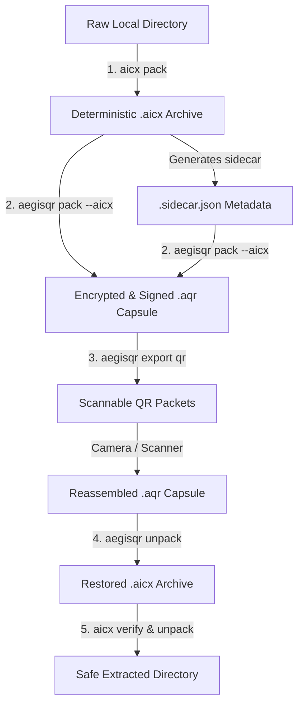

# AegisQR

AegisQR is a **secure, encrypted, signed, and compressed QR-native capsule format** (`.aqr`) for safely packaging and transferring files, code, executables, workflows, model artifacts, configurations, secret placeholders, firmware, and agent tasks.

---

## Table of Contents

1. [What is AegisQR?](#what-is-aegisqr)
2. [Why use AegisQR?](#why-use-aegisqr)
3. [When to use AegisQR](#when-to-use-aegisqr)
4. [Where to use AegisQR](#where-to-use-aegisqr)
5. [Security model and defaults](#security-model-and-defaults)
6. [Build and install](#build-and-install)
7. [Quick start](#quick-start)
8. [CLI reference](#cli-reference)
9. [Interactive UI](#interactive-ui-lightweight-alternative-to-the-cli)
10. [Examples](#examples)
11. [AQR1 capsule format overview](#aqr1-capsule-format-overview)
12. [Project status and roadmap](#project-status-and-roadmap)

---

## What is AegisQR?

An **AegisQR capsule** (`.aqr` file) is a self-describing, tamper-evident bundle that:

- **Encrypts** its payload with XChaCha20-Poly1305 and Argon2id key derivation.
- **Signs** the entire capsule (header, policy, agent metadata, payload hash, chunk table) with Ed25519.
- **Compresses** the payload (zstd at configurable levels) before encrypting.
- **Splits** the capsule into QR-code-sized packets for air-gap transfer or physical hand-off.
- **Quarantines** executable file types on restore — payloads are never automatically executed.
- **Carries its own policy** block that enforces safe defaults (no auto-execute, sandboxing required).

Compared to a simple encrypted zip or tarball, an AegisQR capsule adds:
- Authenticated encryption (the key is bound to bundle identity and policy state — tampering is detected).
- An immutable public header readable without a passphrase (useful for inspection kiosks and routers).
- A chunk table for granular integrity verification and future Reed-Solomon recovery.
- A structured agent-index that describes what the capsule contains without decrypting it.
- QR-packet transport designed for physical or off-line data paths.

---

## Why use AegisQR?

| Concern | How AegisQR addresses it |
|---|---|
| Payload confidentiality | XChaCha20-Poly1305 AEAD with Argon2id; ciphertext is authenticated |
| Integrity / tamper detection | Ed25519 signature covers header, policy, payload hash, chunk table |
| Accidental execution | Executable file types are always quarantined; auto-execute default is `false` |
| Air-gap transfer | Capsule splits into QR packets; each packet carries its own checksum |
| Policy enforcement | Embedded `ClientPolicy` block defines execution constraints |
| Auditability | Public header is inspectable without decryption; structured agent index |
| Future-proof format | Magic bytes `AQR1`, versioned structure, additive CBOR fields |

---

## When to use AegisQR

Use AegisQR when you need to:

- **Transfer files across an air gap** using QR codes printed on paper or displayed on a screen.
- **Hand off a software update, firmware image, or script** to a machine that has no network access.
- **Package secrets placeholders, configuration files, or agent tasks** that must be encrypted at rest and in transit.
- **Distribute a signed artefact** (model weights, policy bundle, executable) to a recipient who must verify the sender's identity before unpacking.
- **Stage potentially executable content for human review** before it is manually inspected and run.
- **Send files physically** (NFC tag, printed QR page, USB stick) when network transport is unavailable or untrusted.

Do **not** use AegisQR today for:
- Real-time or streaming data (AegisQR is a batch capsule format).
- Situations where the recipient must run the payload automatically (auto-execute is disabled in MVP and requires explicit future policy gates).

---

## Where to use AegisQR

| Context | Recommended entry point |
|---|---|
| CI/CD pipeline, scripted workflows | Source-built `aegisqr-cli` (`cargo run -p aegisqr-cli -- ...` or `cargo install --path crates/aegisqr-cli --locked`) |
| Portable or removable-media workflows | Portable installer command `aegisqr` (`./packaging/install.sh` or `./packaging/install.ps1`) |
| Desktop interactive use | `aegisqr-ui` interactive app (`cargo run -p aegisqr-ui`) |
| Rust application integration | `aegisqr-core` crate (add as a dependency) |
| Air-gap workstation (pack side) | CLI `pack` + `export qr` -> print QR sheets |
| Air-gap workstation (receive side) | CLI `import qr` + `verify` + `unpack` / `stage` |
| Secure hand-off kiosk | `inspect` (no passphrase needed) to show public header |

---

## Security model and defaults

- **Scanning does not execute** — reading or decrypting a capsule never runs its payload.
- **Decrypting does not execute** — `unpack` / `stage` write files to disk; they never call `exec`.
- **Restoring does not execute** — even a fully unpacked capsule requires a deliberate manual step to run anything.
- **Auto-execute default is always `false`** — the `auto_execute_default` field in every capsule header is immutably `false` in this implementation.
- **Executable file types are quarantined** — on restore, files with extensions `.sh .py .ps1 .bat .cmd .exe .dll .so .dylib .jar .wasm` are placed in a `quarantine/` subdirectory instead of their nominal output path.
- **Signature is required** — `requires_signature: true` is baked into every capsule produced by this implementation.
- **Policy is required** — an embedded `ClientPolicy` block travels with every capsule; the default policy disables native execution and requires a sandbox.
- **Path traversal is blocked** — `..` components and absolute paths in tar entries or `original_name` are rejected at restore time.
- **Symlinks are blocked** — tar entries that are symlinks or hard links are rejected on pack and restore.

---

## Build and install

### Prerequisites

- Rust 1.78+ (stable toolchain)
- `cargo` in `$PATH`
- A working C toolchain / linker (`cc`) for crates with native build steps such as `zstd-sys`

### Install Rust and toolchain components

If you do not already have Rust:

```bash
curl https://sh.rustup.rs -sSf | sh -s -- -y --profile default
. "$HOME/.cargo/env"
rustup toolchain install stable --component rustfmt --component clippy
rustup default stable
```

On Debian / Ubuntu hosts, install a native build toolchain too:

```bash
sudo apt-get update
sudo apt-get install -y build-essential pkg-config
```

### Build everything

```bash
git clone https://github.com/apeterson22/AegisQR
cd AegisQR
cargo build --workspace
```

### Run the test suite

```bash
cargo fmt --all -- --check
cargo clippy --workspace --all-targets --locked -- -D warnings
cargo test --workspace --locked
```

Run the scenario-focused tests that exercise the end-to-end flows:

```bash
cargo test -p aegisqr-core scenario_ --locked
```

Run a single named test:

```bash
cargo test -p aegisqr-core scenario_roundtrip_file_and_qr_reconstruct -- --exact
```

### Run the CLI without installing

```bash
cargo run -p aegisqr-cli -- --help
cargo run -p aegisqr-cli -- pack ./input.txt --out ./output.aqr
```

### Install the source-built CLI globally

```bash
cargo install --path crates/aegisqr-cli --locked
aegisqr-cli --help
```

After `cargo install`, the executable name is **`aegisqr-cli`**.

### Install a portable bundle

Portable bundles are intended for systems where you do not want to build from source, including removable-media installs and air-gapped handoff workflows.

Remote archive installs must use HTTPS. For direct archive URLs outside the GitHub release flow, provide `--archive-sha256` / `-ArchiveSha256` unless you intentionally bypass verification with the installer skip-checksum flag.

```bash
./packaging/install.sh
./packaging/install.sh --version v0.1.0
./packaging/install.sh --install-dir /media/USB/aegisqr --bin-dir /media/USB/bin
./packaging/install.sh --archive https://example.invalid/aegisqr-x86_64-unknown-linux-gnu.tar.gz --archive-sha256 <sha256> --install-dir /tmp/aegisqr
```

Windows hosts can use:

```powershell
./packaging/install.ps1
./packaging/install.ps1 -Version v0.1.0
./packaging/install.ps1 -Archive https://example.invalid/aegisqr-x86_64-pc-windows-msvc.zip -ArchiveSha256 <sha256>
```

After the portable installers run, the command name is **`aegisqr`**.

See [`docs/portable-install.md`](docs/portable-install.md) for archive-based installation and portable media layouts.

### CI and minimal-host testing

The repository CI runs `cargo fmt`, `cargo clippy`, `cargo test`, the scenario-focused core tests, and a release build with locked dependencies.

On minimal hosts such as Ubuntu Core, source builds still need a user-provided C linker/toolchain. If you do not want to provision that locally, use the portable bundles or rely on GitHub Actions runners for full validation.

---

## Quick start

Choose the command name that matches how you installed AegisQR:

| Installation path | Command to run |
|---|---|
| `cargo install --path crates/aegisqr-cli --locked` | `aegisqr-cli` |
| Portable installer (`install.sh` / `install.ps1`) | `aegisqr` |
| No install, run from source | `cargo run -p aegisqr-cli --` |

The examples below use **`aegisqr`** for readability. If you installed from Cargo, replace `aegisqr` with `aegisqr-cli`. If you are running directly from the repo, prefix commands with `cargo run -p aegisqr-cli --`.

Create a capsule, inspect it, verify it, and restore it:

```bash
# Pack a file into a signed, encrypted capsule
aegisqr pack report.pdf --out report.aqr

# Read the public header without a passphrase
aegisqr inspect report.aqr

# Verify signature and ciphertext chunk integrity
aegisqr verify report.aqr

# Restore the payload
aegisqr unpack report.aqr --out ./restored
```

For automation, use stdin for the passphrase:

```bash
printf '%s' "$AQR_PASSPHRASE" | aegisqr pack ./dist --out release.aqr --passphrase-stdin
printf '%s' "$AQR_PASSPHRASE" | aegisqr unpack release.aqr --out ./restored --passphrase-stdin
```

---

## CLI reference

All commands follow the pattern:

```
aegisqr <subcommand> [options]
```

If you installed with Cargo, substitute `aegisqr-cli`. If you are running from source, substitute `cargo run -p aegisqr-cli --`.

Run `aegisqr --help` or `aegisqr <subcommand> --help` for up-to-date flag descriptions.

---

### `pack` — create a capsule

```bash
aegisqr pack <INPUT> --out <BUNDLE.aqr> [--passphrase-stdin] [OPTIONS]
```

| Option | Default | Description |
|---|---|---|
| `--compression <PROFILE>` | `balanced` | `none` / `fast` / `balanced` / `qr-basic` |
| `--aicx` | off | Treat `INPUT` as an AICX archive (`payload_type: aicx-archive`) |
| `--auto-execute-capable` | off | Mark the capsule as capable of auto-execution (metadata only) |
| `--auto-execute-requested` | off | Declare intent to auto-execute (requires `--auto-execute-capable`) |
| `--passphrase-stdin` | off | Read the passphrase from stdin instead of prompting |

`INPUT` can be a single file **or** a directory (packed as a tar archive).
By default, the CLI prompts for a hidden passphrase and asks for confirmation. For automation, pipe the passphrase over stdin with `--passphrase-stdin`. `AEGISQR_PASSPHRASE` is intentionally rejected because environment variables may be visible to other processes.

```bash
# Pack a single file (interactive hidden prompt)
aegisqr pack report.pdf --out report.aqr

# Pack a directory from CI using stdin
printf '%s' "$CI_PASSPHRASE" | aegisqr pack ./my-project --out project.aqr --compression qr-basic --passphrase-stdin

# Pack an AICX archive with stdin
printf '%s' "$MODEL_PASSPHRASE" | aegisqr pack model.aicx --out model.aqr --aicx --passphrase-stdin
```

---

### `inspect` — read the public header (no passphrase required)

```bash
aegisqr inspect <BUNDLE.aqr>
```

Prints the public header as pretty-printed JSON. Useful for routing and classification without decryption.

```bash
aegisqr inspect report.aqr
```

---

### `verify` — check signature and chunk integrity

```bash
aegisqr verify <BUNDLE.aqr> [--strict-trust] [--trust-store <STORE.json>]
```

| Option | Description |
|---|---|
| `--strict-trust` | Require the signer to be listed in the trust store; fails if no trust store is provided |
| `--trust-store <PATH>` | Path to a JSON `TrustStore` file containing trusted public keys |

```bash
# Verify signature only (any signer)
aegisqr verify report.aqr

# Verify and require a known signer
aegisqr verify report.aqr --strict-trust --trust-store /etc/aegisqr/trust.json
```

---

### `unpack` — decrypt and restore payload

```bash
aegisqr unpack <BUNDLE.aqr> --out <DIR> [--passphrase-stdin]
```

- Verifies the signature before decrypting.
- Extracts all files to `DIR`.
- Files with executable extensions go to `DIR/quarantine/`.
- Prompts for a hidden passphrase by default; automation should pipe the passphrase over stdin with `--passphrase-stdin`.

```bash
aegisqr unpack report.aqr --out ./restored
```

---

### `stage` — quarantine-only restore

```bash
aegisqr stage <BUNDLE.aqr> --out <DIR> [--passphrase-stdin]
```

Identical to `unpack` except **all** files go to `DIR/quarantine/` regardless of type. Use this for maximum caution when the origin of the capsule is unknown.

```bash
printf '%s' "$HOST_PASSPHRASE" | aegisqr stage suspicious.aqr --out ./staging --passphrase-stdin
```

---

### `export qr` — split capsule into QR packets

```bash
aegisqr export qr <BUNDLE.aqr> --out <QR_DIR> [--packet-size <BYTES>] [--png]
```

| Option | Default | Description |
|---|---|---|
| `--packet-size <N>` | `800` | Maximum bytes per QR packet |
| `--png` | off | Also write a `.png` QR image per packet (requires `qr-png` feature, enabled by default) |

Each packet is written as both a `.cbor` file and a `.json` file to `QR_DIR`.

```bash
aegisqr export qr report.aqr --out ./qr-packets --packet-size 600 --png
```

---

### `import qr` — reassemble capsule from QR packets

```bash
aegisqr import qr <QR_DIR> --out <RECOVERED.aqr>
```

Reads all `.cbor` packets (or `.json` if no `.cbor` files are found) from `QR_DIR`, verifies per-packet checksums, verifies the overall capsule hash, and writes the reconstructed capsule.

```bash
aegisqr import qr ./qr-packets --out recovered.aqr
```

---

## Interactive UI (lightweight alternative to the CLI)

The `aegisqr-ui` crate provides a guided terminal menu for all operations. It prompts for paths, passphrases (with echo-off), and options interactively — no flags to remember. The CLI now follows the same hidden-prompt default and reserves stdin / environment variables for automation.

```bash
cargo run -p aegisqr-ui
```

The UI is interactive; it does not provide a useful `--help` mode.

On startup you will see:

```
AegisQR Interface
Secure defaults: scan/decrypt/restore never execute payloads.

Choose an action:
  1) Pack
  2) Inspect
  3) Verify
  4) Unpack
  5) Stage
  6) Export QR
  7) Import QR
  8) Exit
```

Each flow prompts for only the inputs required for that operation. Passphrases are read with hidden input (via `rpassword`). The Pack flow asks for the passphrase twice and rejects mismatches.

---

## Examples

### Personal air-gap file transfer

Pack a sensitive document on the sending machine:

```bash
aegisqr pack secret.pdf --out secret.aqr
aegisqr export qr secret.aqr --out ./qr --packet-size 500 --png
# Print the PNG sheets or display them on screen
```

Reassemble and restore on the receiving machine:

```bash
# Scan QR images into a directory, then:
aegisqr import qr ./scanned-qr --out secret.aqr
aegisqr verify secret.aqr
printf '%s' "$RECEIVER_PASSPHRASE" | aegisqr unpack secret.aqr --out ./received --passphrase-stdin
```

---

### Enterprise signed distribution

A CI pipeline packs and the receiving host verifies against a pinned trust store:

```bash
# Pack (CI side)
printf '%s' "$CI_PASSPHRASE" | aegisqr pack ./dist --out release.aqr --compression qr-basic --passphrase-stdin

# Inspect without decrypting (routing / SIEM)
aegisqr inspect release.aqr

# Verify with strict trust (receiving host)
aegisqr verify release.aqr --strict-trust --trust-store /etc/aegisqr/corp-trust.json

# Stage first for human review
printf '%s' "$HOST_PASSPHRASE" | aegisqr stage release.aqr --out /var/staging --passphrase-stdin
# Review quarantine/ contents, then manually promote
```

---

### Staging unknown content

When the origin of a capsule is not fully trusted, always stage instead of unpack:

```bash
printf '%s' "$HOST_PASSPHRASE" | aegisqr stage unknown.aqr --out ./sandbox --passphrase-stdin
# All files land in ./sandbox/quarantine/
# Manually inspect before promoting any executable
```

---

### Programmatic use (Rust)

Add `aegisqr-core` to your `Cargo.toml`:

```toml
[dependencies]
aegisqr-core = { path = "crates/aegisqr-core" }
```

```rust
use aegisqr_core::{pack_to_file, verify_capsule, unpack_capsule, PackOptions};
use std::path::Path;

// Pack
let capsule = pack_to_file(
    Path::new("input.txt"),
    Path::new("output.aqr"),
    "my-passphrase",
    PackOptions::default(),
)?;

// Verify (no passphrase needed)
verify_capsule(Path::new("output.aqr"), None, false)?;

// Unpack
unpack_capsule(Path::new("output.aqr"), Path::new("out-dir"), "my-passphrase")?;
```

---

## AQR1 capsule format overview

| Field | Details |
|---|---|
| Magic bytes | `AQR1` (4 bytes, unencrypted) |
| Encoding | Deterministic CBOR after the magic |
| Encryption | XChaCha20-Poly1305; key derived via Argon2id from passphrase + 16-byte salt |
| Signature | Ed25519; covers header, section table, policy block, payload hash, agent index hash, chunk table hash |
| Compression | zstd (levels 1 / 5 / 9 for fast / balanced / qr-basic; or none) |
| Chunk size | 1024 bytes; each chunk carries a BLAKE3 hash |
| QR packet magic | `AQRP`; each packet carries its own BLAKE3 checksum and the full capsule hash |

See [`SPEC.md`](SPEC.md) for the complete schema.

---

## Integration with AICX and the AegisQR Suite

AegisQR and **AICX** (AI-native adaptive compression and semantic archive) are designed as sibling, decoupled repositories that communicate strictly via deterministic metadata sidecars and CLI workflows. Together, they form the **AegisQR Suite**—a unified enterprise package for zero-trust secure transport, planogram role gating, and RAG context verification.

Within the suite, AegisQR serves as the **cryptographic envelope and physical courier layer**, protecting the integrity and confidentiality of the highly optimized `.aicx` knowledge archives.

### 1. Unified Suite Architecture
* **AICX Role:** Formats, compresses, and generates machine-readable indexes and ScoutAI query sidecars for directories, models, or catalogs.
* **AegisQR Role:** Encapsulates the compressed `.aicx` archive into a secure `.aqr` capsule, enforces role-gating (customer vs associate), signs the header with Ed25519, and splits the payload into visual QR packet sequences for off-grid camera transit.
* **AegisQR Suite Role:** Provides the overall distribution layer at the repository root, bundling both binaries into a single, unified installation script (`install.sh`), ensuring version alignment (`VERSION.json`), and presenting a unified management CLI.



### 2. Coordinated Enterprise Licensing
Both applications share the exact same cryptographic, offline-first licensing core, validating organization tiers and seat counts natively without calling home:
* **Shared Config Paths:** Installing a `.aqlic` file with `aegisqr license install` automatically updates `/etc/aegisqr/license.aqlic` or `~/.config/aegisqr/license.aqlic`, immediately activating license permissions for `aicx` as well.
* **Shared Key Rotation:** Trust directories in `/etc/aegisqr/trusted_keys.d/` dynamically rotate Ed25519 signing keys for both tools concurrently.

### 3. AICX Sidecar Ingestion

#### When to Use
Use AICX sidecar ingestion when you want to wrap a deterministic, compressed `.aicx` archive into a secure AegisQR capsule (`.aqr`) while enriching the capsule's unencrypted `AgentIndex` with archive intelligence (such as risk hints, entrypoints, and query hints) to let edge AI nodes or agents inspect the archive's metadata without requiring the decryption passphrase.

#### How to Use
Ingest a sidecar explicitly using the `--aicx-sidecar` flag during capsule packing:
```bash
aegisqr pack payload.aicx \
  --aicx-sidecar payload.sidecar.json \
  --out payload.aqr \
  --passphrase-stdin <<< "your-secret-passphrase"
```

##### Strict Mode Validation (`--aicx-strict`)
To enforce strict, fail-closed production validation, pass `--aicx-strict`:
```bash
aegisqr pack payload.aicx \
  --aicx-sidecar payload.sidecar.json \
  --out payload.aqr \
  --aicx-strict \
  --passphrase-stdin <<< "your-secret-passphrase"
```
In strict mode, AegisQR will immediately abort packing if:
* The sidecar is missing or malformed.
* The `.aicx` payload BLAKE3/SHA-256 hash does not match the sidecar's `archive_digest`.
* The sidecar schema version is unsupported (only version `2` is supported).
* The digest algorithm is unsupported (only `blake3` and `sha256` are supported).

##### Developer Autodiscovery
If you pass the `--aicx` flag without an explicit `--aicx-sidecar` path, AegisQR automatically searches for sidecars next to the input file in this order:
1. `<payload>.aicx.sidecar.json`
2. `<payload>.sidecar.json`
3. `<payload>.aicx.json`
4. `<payload>.aicx.sidecar.cbor`
5. `<payload>.sidecar.cbor`

If no companion sidecar is found, it falls back to a warning and packages in reduced, digest-only mode.

---

### 2. Retail Signed Deep-Linking

AegisQR supports generating ultra-compact, offline-verifiable, signed universal deep-linking profiles for shelf labels, catalog items, and retail workflows.

#### When to Use
* **Customer shelf labels:** Scans decode to a secure, signed HTTPS Universal Link. Standard phone camera apps can open the fallback URL directly in a browser without needing AegisQR installed.
* **Associate inventory/planogram tasks:** The store device's application intercepts the universal link, validates the Ed25519 signature offline, parses the `role: "associate"` payload, and safely routes the associate to restricted workflows.

#### How to Use

##### Pack a Retail Signed Link (`pack-retail`)
Generate a signed HTTPS Universal Link containing a CBOR-packed, Ed25519-signed payload:
```bash
aegisqr pack-retail \
  --retailer-id "aegisqr" \
  --sku "1002345" \
  --store-id "store-0452" \
  --role "associate" \
  --privkey "0707070707070707070707070707070707070707070707070707070707070707" \
  --kid "key-1" \
  --out signed_link.txt
```
*Options:* Use `--expires-in-secs <seconds>` to set a temporary, self-expiring link signature. Use `--base-url <URL>` to supply a custom enterprise domain or path (defaults to `https://aegisqr.app/qr/product`). Existing query parameters on custom base URLs are dynamically parsed and merged.

##### Verify a Retail Link Offline (`verify-retail`)
Verify the link's signature offline against a local trust store:
```bash
aegisqr verify-retail \
  --url-file signed_link.txt \
  --pubkey "ea4a6c63e29c520abef5507b132ec5f9954776aebebe7b92421eea691446d22c" \
  --kid "key-1" \
  --authenticated-associate
```
*Note:* The `--authenticated-associate` flag simulates a verified associate session. Signed retail deep-links with `role: "associate"` will fail closed with an `Access Denied` error unless this session verification is supplied.

---

## Enterprise Licensing & Administration

AegisQR includes an offline-first cryptographic licensing subsystem that validates operational seat counts, validity parameters, and enterprise features without requiring a network connection or telemetry transmission (protecting corporate privacy).

### License Configuration Directories
AegisQR searches for installed `.aqlic` license files in the following order:
1. `AEGISQR_LICENSE_PATH` environment variable.
2. Global config: `/etc/aegisqr/license.aqlic`
3. Portable User configuration: `~/.config/aegisqr/license.aqlic`
4. Local workspace directories: `./license.aqlic` and `./.aegisqr.aqlic`

To support rotating enterprise licensing keys, copy supplementary public keys in hex format into:
`/etc/aegisqr/trusted_keys.d/` or `~/.config/aegisqr/trusted_keys.d/`

### Licensing CLI Reference

##### 1. Install an Enterprise License
Install an authentic `.aqlic` file to the config paths (it is validated before copy):
```bash
aegisqr license install ./my_license.aqlic
```

##### 2. Check License Status
Query current license validity state:
```bash
aegisqr license status
```
*Tip:* Mandate the `--json` output option for programmatic parent-process checks:
```bash
aegisqr license status --json
```

##### 3. View Full License Structure
```bash
aegisqr license show --json
```

### Expiration & Grace Period Behavior
* **Active Grace Days:** The tool executes successfully but writes a clear warning to `stderr` on every run:
  `WARNING: License expired. Running in grace period: X days remaining.`
* **Expired Trial Reminders:** If unlicensed or fully expired, core utilities **are never blocked** (ensuring data restore operations are safe). Instead, a developer-friendly weekly trial reminder requesting coffee donations is output to `stderr` on Mondays.

---

## Standardized JSON Output for Programmatic Integration

To support seamless enterprise child-process wrappers (such as Python `subprocess` or Node `child_process` orchestrators), all key query commands support a standardized `--json` flag. The returned JSON schema is version-locked, preventing upstream structural breaks.

For example, to verify a retail label deep-link and parse its signed payload programmatically:
```bash
aegisqr verify-retail --url-file signed_link.txt --pubkey <KEY> --kid <KID> --json
```

---

## 🛡️ Mission: Security & Secure Information Sharing in the AI Age

In the era of autonomous AI agents, automated code generation, and hyper-connected supply chains, traditional perimeter security has collapsed. Information is no longer shared merely between human operators; it is ingested, transformed, and acted upon by AI models operating across untrusted network nodes.

This technological revolution introduces critical security threats:
1. **Adversarial Payload Injection:** Untrusted files, prompts, and model updates can exploit parsing pipelines, risking automated execution.
2. **Data Leakage & Telemetry Risks:** Heavy telemetry-based licensing structures leak sensitive operational schemas, catalogs, and network locations to third-party servers.
3. **Unsigned Agent Actions:** Unauthenticated code and tasks can run unchecked inside isolated corporate networks.

### The AegisQR Solution: Cryptographic Zero-Trust

AegisQR is engineered to establish **unbreakable cryptographic trust boundaries** for files and payloads before they reach downstream models or execution runtimes:
* **Zero Trust Offline Validation:** Signature validation, decryption, and licensing run entirely offline. Your data never leaves your networks.
* **Fail-Closed Gatekeeping:** Unknown signing keys, modified parameters, or malformed sidecars quarantine operations immediately.
* **Sanitized Restores:** Files are compressed, encrypted, verified, and staged with strict path-traversal prevention and mandatory executable quarantining. Scans never execute code.

By combining self-describing metadata packaging with robust Ed25519 signature enforcement and XChaCha20-Poly1305 payload insulation, AegisQR provides a cryptographic trust anchor, enabling humanity and autonomous AI agents to share critical store data, packages, and configurations safely, privately, and securely in the AI age.
